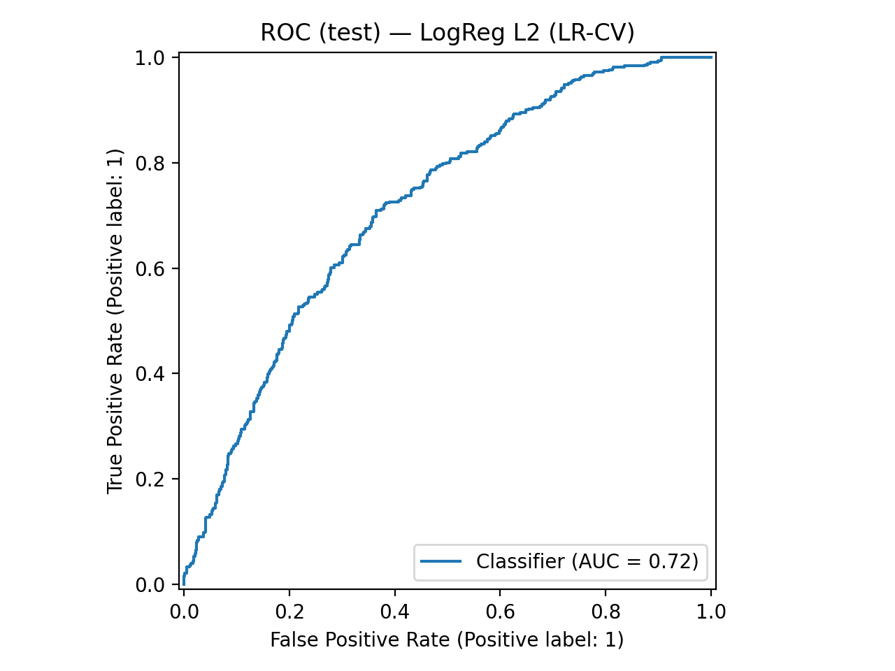
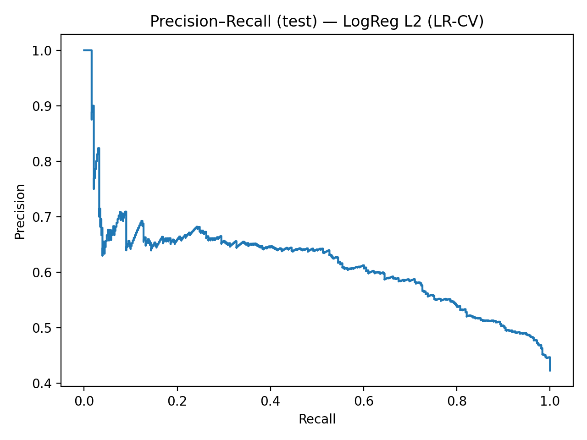
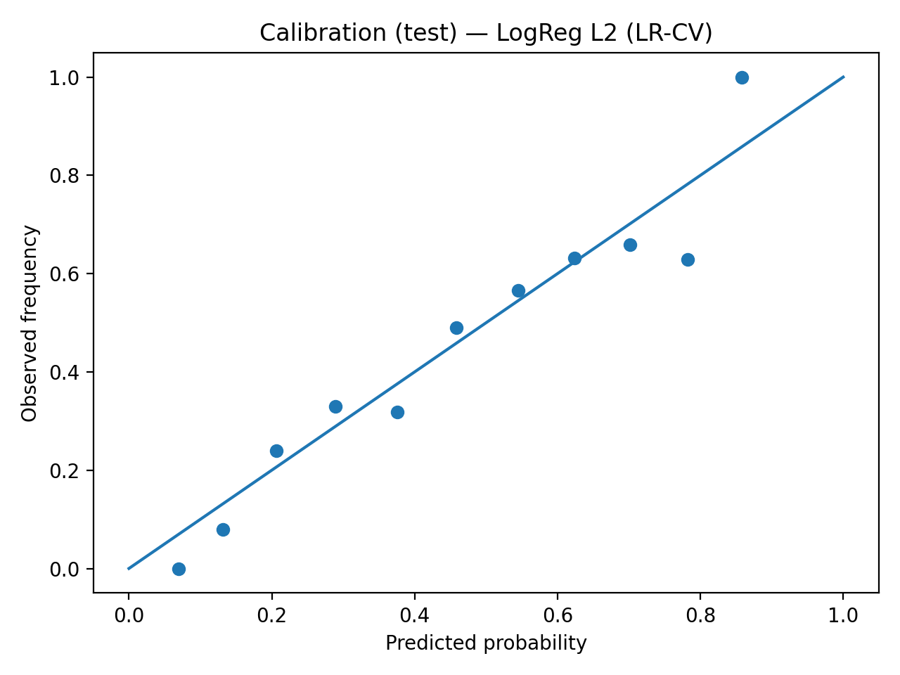

# Objective(s)

The goal of this project is to develop a **supervised binary classification model** that identifies whether an adult is *likely prediabetic* based solely on self-reported survey data from the NHANES Continuous Questionnaire (August 2021–August 2023). The model predicts the probability that each respondent falls within clinical prediabetes ranges for either **fasting plasma glucose** (LBXGLU: 100–125 mg/dL) or **glycohemoglobin (HbA1c)** (LBXGH: 5.7–6.4%).

Our specific objectives are to:

1.  **Train a binary classifier** (e.g., logistic regression or random forest) that estimates the probability of prediabetes using selected demographic, lifestyle, and self-reported health features.

2.  **Label individuals as “likely prediabetic” or “not likely prediabetic”** by applying a probability threshold, effectively identifying who should be referred for confirmatory laboratory testing.

3.  **Evaluate model performance** by comparing predicted labels to true lab-based outcomes using metrics such as accuracy, recall, precision, and ROC AUC.

4.  **Demonstrate the potential of survey-based screening** as a low-cost, scalable method to guide early detection and prioritize follow-up testing.

**Why this matters:**\
Prediabetes is widespread yet often undiagnosed, as many adults do not undergo routine blood testing. A survey-based model that flags individuals as *likely prediabetic* provides a simple, accessible first step—allowing clinics and community health programs to focus lab resources on those most at risk, promote earlier diagnosis, and help prevent progression to Type 2 diabetes.

# Data Description

**Data:** Continuous NHANES (CDC/NCHS), Aug 2021–Aug 2023. One row per adult respondent (age ≥ 18), identified by `SEQN`. The dataset contains 5,099 adult respondents. 
**Target:** `prediabetes_flag` (defined from lab variables only for target construction, then labs removed from predictors).  
**Predictors (survey-only):**  
- **Numeric:** age, BMI from self-report, 1-year weight change, weekday sleep hours, sedentary minutes, drinks per day (12 mo).  
- **Categorical:** sex, race/ethnicity, smoking indicators, selected medical history (BP, cholesterol, asthma, thyroid, liver), weight-loss attempt, and PHQ-9 “poor appetite”, etc.  
**Prevalence:** ~0.423 (class 1), where 43% of all people in the dataset are labeled as "1", which is "likely prediabetic"
**Provenance & license:** CDC/NCHS public domain; de-identified and IRB-approved protocols.

## Dataset Overview

Our analysis uses the **Continuous NHANES (National Health and Nutrition Examination Survey)** dataset collected between **August 2021 and August 2023**, publicly released by the **U.S. Centers for Disease Control and Prevention (CDC)** and the **National Center for Health Statistics (NCHS)**.\
NHANES combines structured interviews, physical examinations, and laboratory tests to assess the health and nutritional status of adults and children in the United States.

Each observation (row) represents a unique adult respondent (age ≥ 18) identified by `SEQN`. Each attribute (column) represents either a self-reported questionnaire response, a derived health indicator, or one of the laboratory variables used to construct the binary outcome.

## Purpose and Funding

NHANES was established to monitor the health and nutrition of the U.S. population and inform evidence-based public health policy.\
It is funded and managed by the **U.S. Department of Health and Human Services (HHS)** through the **CDC’s National Center for Health Statistics (NCHS)**.\
Our project repurposes these publicly available data to test whether **survey-only predictors** can accurately identify individuals at risk for prediabetes, thereby supporting lower-cost, early screening strategies.

## Observations and Attributes

-   **Observations:** One adult respondent per row, uniquely identified by `SEQN`.
-   **Target variable:**
    -   `prediabetes_flag` = 1 if fasting plasma glucose (`LBXGLU`) ∈ \[100, 125\] mg/dL or glycohemoglobin (`LBXGH`) ∈ \[5.7, 6.4%\]; otherwise 0.\
    -   Laboratory variables were used **only for constructing the target** and removed prior to modeling.
-   **Predictor attributes (self-reported or demographic):**
    -   **Demographics:** Age (`RIDAGEYR`), sex (`RIAGENDR`), race/ethnicity (`RIDRETH3`)
    -   **Anthropometrics & weight history:** Self-reported height, weight, one-year weight change, BMI, and weight-loss attempts
    -   **Behavioral indicators:** Smoking and alcohol use, sedentary minutes, sleep duration, physical activity frequency
    -   **Medical history:** Cardiovascular disease, hypertension, high cholesterol, asthma, thyroid or liver/kidney disorders
    -   **Mental health:** PHQ-9 items such as “felt down,” “poor appetite,” and “little interest”
    -   **Derived features:** `bmi_from_selfreport`, `weight_change_1y_lb`, `ever_smoker`, `current_smoker`, and boolean indicators for categorical responses

## Data Generation and Collection Process

The **NHANES 2021–2023** survey uses a **stratified multistage probability design** to yield a nationally representative sample of U.S. civilians.\
Data collection involves: - **Interviews** conducted in participants’ homes to record demographic, dietary, and behavioral information. - **Physical examinations and lab measurements** performed in mobile exam centers by trained medical staff. - **Standardized coding** by NCHS personnel to ensure consistency across modules and years.

Questionnaire modules (e.g., Demographics, Weight History, Physical Activity, Smoking, Medical Conditions, Mental Health) are self-reported, whereas lab measures (e.g., glucose, HbA1c) are obtained via blood draws.\
Missingness stems from nonresponse, skip patterns, and module-level exclusions.

## Preprocessing and Cleaning

1.  **Merge:** Combined `.XPT` files from DEMO, WHQ, SLQ, SMQ, MCQ, and DPQ modules via `SEQN`.
2.  **Filter:** Included adults (≥18 years) with valid glucose or HbA1c for target creation; excluded diagnosed diabetics and medication users.
3.  **Variable curation:**
    -   Retained questionnaire-based predictors only.
    -   Dropped design weights and pregnancy items.
    -   Cleaned implausible values and standardized numeric types.
4.  **Feature engineering:**
    -   Derived BMI, one-year weight change, and smoking indicators.
    -   Median-imputed numerics (with missing flags) and constant-imputed categoricals (`"Unknown"`).
    -   One-hot-encoded categorical variables with `min_frequency` thresholding and scaled numerics.
5.  **Finalize:** Removed all lab predictors post-target creation to yield a **deployable, survey-only dataset**.\
    Exported as `cleaned_data.csv`.

## Data Provenance and Licensing

-   **Source:** U.S. Centers for Disease Control and Prevention (CDC), National Center for Health Statistics (NCHS).
-   **Official citation:**\
    *Centers for Disease Control and Prevention (CDC). National Center for Health Statistics (NCHS). National Health and Nutrition Examination Survey Data, 2021–2023. Hyattsville, MD: U.S. Department of Health and Human Services, Centers for Disease Control and Prevention.*
-   **Access:** Publicly available at <https://wwwn.cdc.gov/nchs/nhanes/>.
-   **License:** U.S. Government Work — data are in the public domain and may be reused with attribution to CDC/NCHS.

## Ethical Use and Data Governance

All NHANES participants provide **written informed consent**, and the study protocol is approved by the NCHS Research Ethics Review Board. All datasets are **de-identified prior to public release** to protect participant privacy.\
Our use complies with CDC’s public data use policy and aligns with ethical principles of **responsible data reuse** for population health benefit.

# Data Limitations

While the NHANES dataset offers exceptional breadth and quality, several limitations could influence how our results are interpreted and applied in real-world contexts. We critically reflect on these issues below, considering both technical and societal implications.

### 1. Self-Report Bias and Social Desirability Effects

Many predictors, such as weight, exercise, alcohol intake, and mental health symptoms, are self-reported. Respondents may understate behaviors perceived as unhealthy or overstate positive habits.\
**Impact:** This introduces systematic bias: our model may underestimate risk among individuals who misreport lifestyle factors, particularly in populations more likely to minimize unhealthy behaviors (e.g., higher socioeconomic groups or health-conscious respondents). Consequently, risk predictions could appear overly optimistic for certain subgroups.

### 2. Missingness and Hidden Exclusion

Nonresponse, skip logic, and refusal to answer sensitive questions (e.g., mental health or alcohol use) create structured missingness. Participants with more missing data are often those facing higher health risks.\
**Impact:** If missingness is not random, models trained on complete data may implicitly learn a *healthier-than-average* population, limiting generalizability to marginalized or low-response groups. This can unintentionally exclude the very individuals most at risk of prediabetes.

### 3. Cross-Sectional Design and Temporal Drift

NHANES is a snapshot survey; it does not track individuals over time. Behavioral and health changes that precede or follow prediabetes diagnosis are not captured.\
**Impact:** The model captures associations, not causation. A strong predictive feature may reflect correlation (e.g., weight-loss attempts) rather than direct risk. Moreover, lifestyle trends shift annually, so a model trained on 2021–2023 data may degrade as public health behaviors evolve.

### 4. Measurement Error and Module Inconsistency

Small differences in question wording, translation, or measurement protocols occur across cycles, even within the 2021–2023 period. For example, physical activity modules and mental health scales occasionally vary in structure or response coding.\
**Impact:** This limits comparability across cycles and introduces subtle noise into derived variables (e.g., sedentary minutes or PHQ-9 scores), which may reduce predictive power or create spurious effects.

### 5. Representativeness and Exclusion Effects

Although NHANES is nationally representative, our filtered sample removes participants under 18, those diagnosed with diabetes, and those missing key labs.\
**Impact:** This constrains external validity—our model estimates risk only among undiagnosed adults, not the general population. Using it outside this context (e.g., for pediatric screening or already-diagnosed diabetics) could lead to misleading risk predictions.

### 6. Potential Harms and Ethical Considerations

Even though our dataset is de-identified, any predictive model built on demographic and behavioral data risks reinforcing health inequities if deployed naively. For instance, a model that relies heavily on race or income-related proxies could reflect structural health disparities rather than biological risk.\
**Impact:** Without careful contextualization, the results could inadvertently perpetuate bias, flagging certain groups as “higher risk” due to social determinants rather than modifiable factors. Transparent communication and human oversight are essential before any real-world application.

## Summary

This dataset represents a nationally representative, ethically collected sample with standardized measures and broad public-health value. By leveraging its self-reported features for predictive modeling, this project demonstrates how **publicly funded, open-source data** can support equitable and cost-effective chronic disease screening.

# Decisions Based on EDA

Our exploratory data analysis (EDA) guided a series of deliberate decisions to prepare the NHANES 2021–2023 survey data for predictive modeling.

### 1. Variable Inclusion and Exclusion

**EDA findings:**\
Initial inspection showed that many raw NHANES modules contain redundant or low-informative variables, including coded duplicates, high-missingness items, and post-lab indicators that would leak target information.

**Decisions:** - Dropped all `_code` columns that were redundant with their `_ans` counterparts to remove unnecessary categorical duplicates.\
- Excluded identifiers (`SEQN`) and direct lab variables (`LBXGLU`, `LBXGH`) after creating the target label to prevent label leakage.\
- Removed columns with over \~30–40% missingness (e.g., pregnancy and certain liver condition items) and variables representing post-diagnosis status to maintain clean, generalizable predictors.\
- Retained only demographic, behavioral, medical-history, and self-report variables that would be available *before* clinical testing — aligning the dataset with a “survey-only screening” use case.

**Rationale:**\
EDA confirmed that keeping lab or post-diagnosis variables artificially inflated predictive performance. Excluding these ensures that model results reflect realistic, deployable screening conditions.

### 2. Handling Missing and Implausible Values

**EDA findings:**\
Histograms and summary tables revealed sporadic missingness and implausible numeric values (e.g., sedentary_minutes \> 2000/day). Some categorical fields also contained “Refused” or “Don’t know” codes that were sparse and unevenly distributed.

**Decisions:** - Set implausible numeric outliers beyond physiologic limits to `NaN`.\
- For numeric features, applied **median imputation** (robust to skew) and added missingness indicators to preserve signal about nonresponse behavior.\
- For categorical features, replaced missing or special codes with `"Unknown"`, then one-hot encoded all categories to maintain interpretability.

**Rationale:**\
These choices preserve sample size and avoid bias from listwise deletion. Adding missing-indicator features allows models to learn from systematic nonresponse patterns, which EDA revealed to correlate weakly with risk.

### 3. Transformation and Encoding

**EDA findings:**\
Numeric distributions varied in scale (e.g., age vs. minutes of sedentary activity), and categorical features contained many low-frequency levels (especially for race_eth and medical-history items).

**Decisions:** - Scaled numeric features using **StandardScaler** to standardize mean/variance before penalized regression.\
- Collapsed rare categorical levels using `min_frequency=0.02` in `OneHotEncoder` to reduce high-dimensional sparsity and improve model stability.\
- Cast all categorical columns to string type before encoding to ensure consistent handling by the pipeline.

**Rationale:**\
Standardization and level-collapsing prevent unstable model coefficients and overfitting. This was validated by EDA frequency tables that showed several categories with fewer than 5% representation.

### 4. Derived and Engineered Features

**EDA findings:**\
Weight, smoking, and activity features exhibited strong nonlinear trends with the target, while “weight-change” and “ever-smoker” variables provided additional behavioral context.

**Decisions:** - Created derived variables such as `bmi_from_selfreport`, `weight_change_1y_lb`, `ever_smoker`, and `current_smoker` based on raw survey responses.\
- Retained behavioral indicators (e.g., `tried_lose_weight_past_year_ans`, `dpq_poor_appetite_ans`) that had sufficient variance and plausible biological connection to metabolic risk.\
- Excluded redundant metrics (e.g., calculated BMI from NHANES vs. self-reported BMI) to avoid multicollinearity.

**Rationale:**\
EDA scatterplots and correlation matrices indicated that these engineered variables added predictive signal while avoiding multicollinearity. Derived features improved interpretability by framing raw responses in clinically relevant terms.

### 5. Class Balance and Evaluation Choices

**EDA findings:**\
The target variable was moderately imbalanced (≈42% prediabetic). Class distributions were stable across demographic subgroups, but accuracy alone would not capture meaningful performance.

**Decisions:** - Preserved natural class proportions in both train/test splits (via `stratify=y`).\
- Opted against oversampling or undersampling to maintain epidemiologic realism.\
- Chose evaluation metrics sensitive to imbalance—**ROC AUC**, **PR AUC**, and **Brier score**, and later tuned decision thresholds to prioritize **recall ≥ 0.80**, based on public-health context.

**Rationale:**\
These choices ensure evaluation metrics reflect model usefulness in identifying at-risk individuals rather than optimizing overall accuracy.

### Summary

Our EDA-driven preprocessing and feature-engineering pipeline reflects a balance between data fidelity, interpretability, and predictive robustness. Each decision—from column exclusion to imputation and encoding—was made after examining variable distributions, missingness patterns, and domain relevance. Together, these steps produced a clean, representative dataset for fair and meaningful evaluation of prediabetes risk models.

# Resampling Strategy

Our modeling pipeline uses a two-stage resampling design consisting of (1) a **stratified train/test partition** and (2) **stratified 5-fold cross-validation** within the training set. This approach ensures representative sampling, protects against information leakage, and yields stable, reproducible performance estimates.

### Stage 1 — Train/Test Partition (80 / 20, Stratified)

We divided the dataset into an 80 % training set and a 20 % test set using `train_test_split(stratify=y, random_state=42)`. The target variable (`prediabetes_flag`) has a prevalence of roughly 0.42, so stratification was essential to preserve class proportions across partitions.

**Justification**

-   **Representative evaluation:** Stratification maintains the natural ratio of prediabetic to non-prediabetic respondents, avoiding inflated accuracy from majority-class dominance.
-   **Realistic generalization:** The held-out test set acts as unseen data used only once, at the end of modeling, simulating a true deployment environment.
-   **Reproducibility:** Fixing a random seed (`random_state=42`) ensures identical splits for future reruns and peer verification.

### Stage 2 — Stratified 5-Fold Cross-Validation on the Training Set

Within the 80 % training subset, we used `StratifiedKFold(n_splits=5, shuffle=True)` for all model tuning and validation steps. Each fold keeps the same class balance as the full training data.

**Justification**

-   **Low bias and variance:** Five folds provide a stable compromise between variance reduction and computational efficiency.
-   **Consistent class ratios:** Stratified folds prevent misleading metrics due to imbalanced subsets.
-   **Robust hyperparameter search:** Cross-validation was embedded within `LogisticRegressionCV` and `GridSearchCV` for penalized regressions, Random Forest, and HistGradientBoosting models—ensuring tuning occurs only on training folds and not on the final test set.
-   **Comparable metrics across workflows:** Using a unified 5-fold structure allowed fair comparison of ROC AUC, Brier score, and PR AUC across all models.

### Stage 3 — Threshold Calibration for Public-Health Recall Goals

After model selection, we tuned the classification threshold on a **validation split (20 % of training)** to achieve a **minimum recall ≥ 0.80**. This reflects a screening-oriented use case: in prediabetes detection, *false negatives are more harmful* than false positives.

**Justification**

-   **Public-health alignment:** Prioritizing recall ensures potentially at-risk individuals are flagged for further lab testing.
-   **Preserving natural prevalence:** We avoided oversampling or class-weight distortion, preferring threshold calibration that keeps the underlying population ratios intact.
-   **Transparent trade-off:** Reporting metrics at the chosen threshold (precision, recall, F1, confusion-matrix counts) makes the cost of higher sensitivity explicit.

### Summary

Our resampling pipeline — **stratified 80/20 split → 5-fold CV → recall-calibrated thresholding** — was chosen to:

1.  Maintain representativeness of the U.S. adult population as captured by NHANES 2021–2023.
2.  Prevent information leakage between training, validation, and test phases.
3.  Produce stable, unbiased performance estimates grounded in realistic screening objectives.

# Modeling Strategies

**Shared preprocessing**  
- Numeric: median imputation (+ missing indicators for linear models), standardization for penalized regression.  
- Categorical: constant imputation (“Unknown”), cast to string, **OHE** with minimum frequency threshold to collapse rare levels.

**Models & tuning**  
- **Logistic Regression (L2):** `Cs = {0.1,1,10}`, `lbfgs`, CV scored by ROC AUC.  
- **Elastic Net LR:** grid on `C = {0.5,1,2}`, `l1_ratio = {0.2,0.5,0.8}` (`saga`); optional **Platt calibration**.  
- **HistGradientBoosting:** two grids (balanced vs deeper) over learning rate, max leaves, min samples leaf, L2.  
- **Random Forest:** `n_estimators ∈ {300,600}`, `max_depth ∈ {None,12}`, `min_samples_leaf ∈ {1,2,5}`, `max_features ∈ {"sqrt",0.3}`, `class_weight="balanced"`.

**Selection metrics**: prioritize **ROC AUC** (discrimination) and **Brier** (calibration); report **PR AUC** given moderate imbalance.

# Initial Results

**Null model (majority class, CV)**
- Accuracy **0.577**, ROC AUC **0.500**, PR AUC **0.423**, Brier **0.423**.

## Cross-validation comparison (training folds; mean)

| Workflow                  | ROC AUC | Brier  | Acc    | Bal Acc |
|---|---:|---:|---:|---:|
| **LogReg L2 (LR-CV)**     | **0.708** | **0.214** | 0.656 | 0.640 |
| LogReg EN + Calib         | 0.707 | 0.214 | 0.656 | 0.638 |
| LogReg ElasticNet         | 0.707 | 0.214 | 0.658 | 0.641 |
| RandomForest (tuned)      | 0.699 | 0.218 | 0.651 | 0.654 |
| HGB T1 (balanced)         | 0.690 | 0.219 | 0.644 | 0.631 |
| HGB T2 (deeper)           | 0.676 | 0.223 | 0.629 | 0.611 |

**Winner:** **LogReg L2 (LR-CV)** by ROC AUC and Brier.

## Test set (held-out)

- **Probabilities (no thresholding)**  
  ROC AUC **0.717**, PR AUC **0.615**, Brier **0.210**, prevalence **0.423**.

- **Thresholded for recall target (selected on validation)**  
  Threshold **0.3833** → **Precision 0.552**, **Recall 0.763**, **F1 0.641**.  
  Confusion matrix: **TN 322, FP 267, FN 102, TP 329**.

**Interpretation:** The penalized LR generalizes well; after tilting toward higher recall (screening), precision remains acceptable.

## Group metrics (test, thresholded)

- **Sex** — Female: P **0.537**, R **0.732**, F1 **0.619**; Male: P **0.566**, R **0.793**, F1 **0.660**.  
- **Race/ethnicity (top 6 by n)** —  
  NH White: P **0.518**, R **0.754**, F1 **0.614**; NH Black: P **0.636**, R **0.792**, F1 **0.706**;  
  Other Hisp.: P **0.526**, R **0.769**, F1 **0.625**; Mex. Am.: P **0.667**, R **0.780**, F1 **0.719**;  
  NH Asian: P **0.525**, R **0.778**, F1 **0.627**; Other/Multiracial: P **0.708**, R **0.739**, F1 **0.723**.

**Note:** Recall is consistently high (desired); precision varies moderately—monitor as we iterate features/thresholds.

## Curves & calibration

  
  

**Calibration:** Points are reasonably close to the diagonal; **Brier ≈ 0.21** indicates acceptable overall calibration. Platt calibration on the elastic net model didn’t materially improve global metrics; can revisit calibration on the chosen LR if tighter probability estimates are required.
